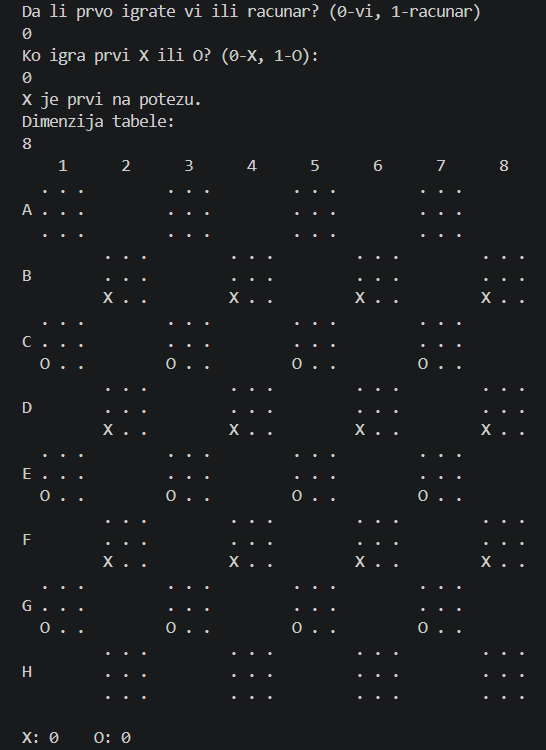
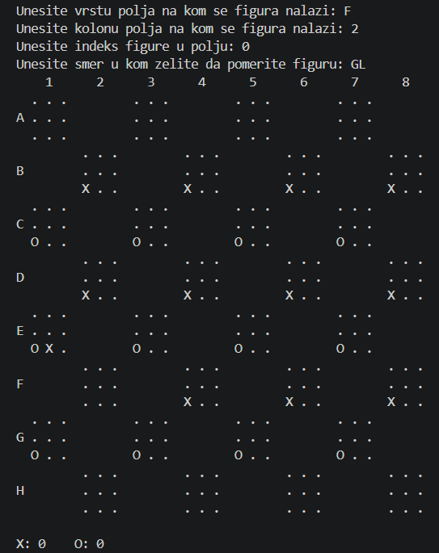
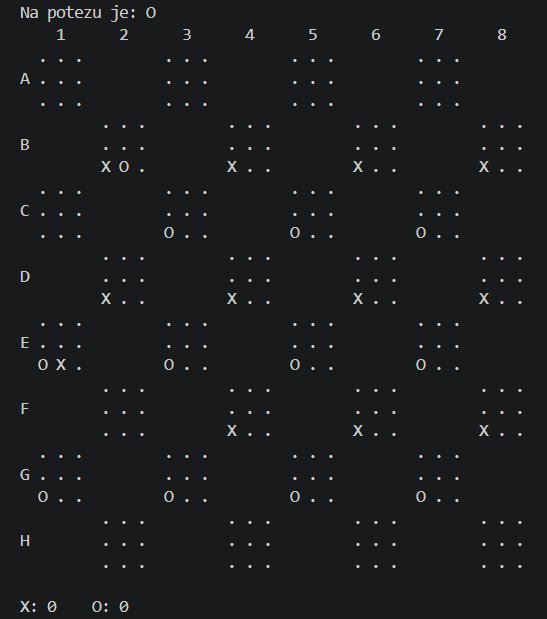
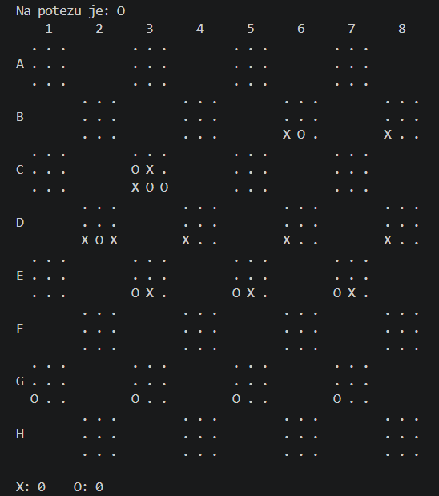
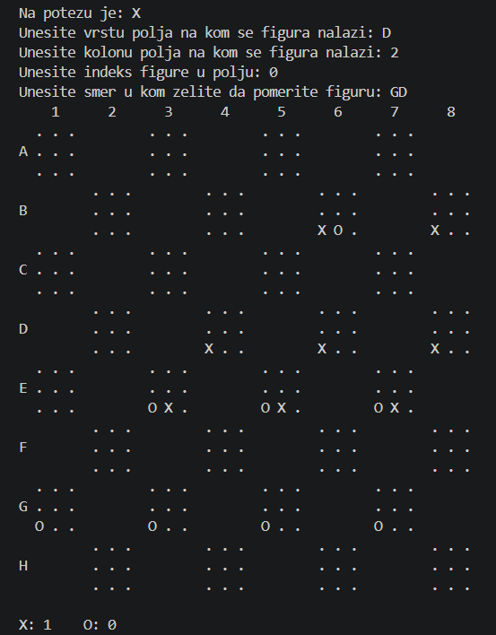
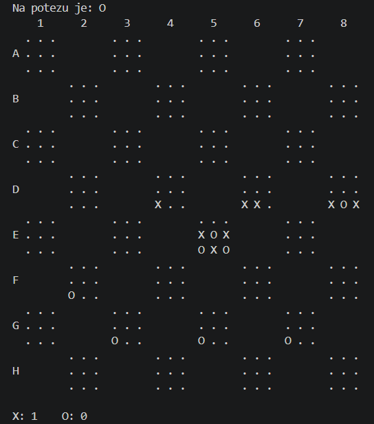
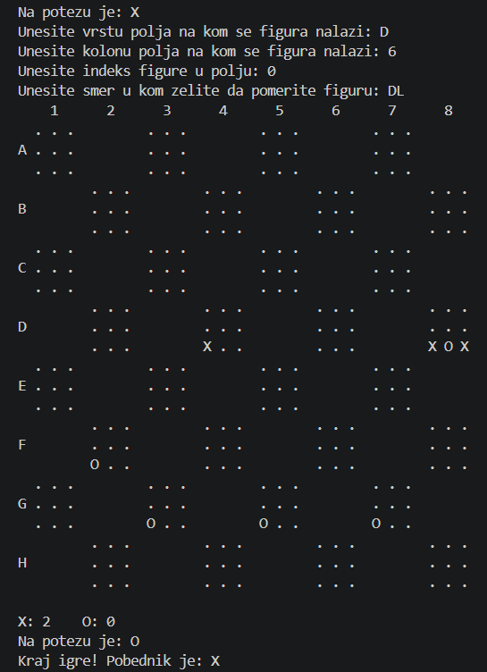

# ByteGame
ByteGame is a Python game supporting single-player mode against an AI-controlled opponent.

## Features
- Single-player mode against a computer (AI opponent)
- Simple heuristic-based AI
- Minimax algorithm with alpha-beta pruning
- Console-based (CLI) game
- Turn-based game mechanics with clear state transitions

## Technologies Used
- Python

## How It Works
- ByteGame is a turn-based console game where two players take turns making moves according to the game rules. The game maintains a shared state that is updated after each move.
- In single-player mode, the human player competes against a computer-controlled opponent. The AI uses the Minimax algorithm with alpha-beta pruning to evaluate possible moves. A simple heuristic function is used to estimate board states, prioritizing moves that avoid giving the opponent immediate scoring opportunities.
- The game continues until a win condition is reached, after which the final result is displayed in the console.
- All interaction happens through the terminal, where players input their moves and receive game updates after each turn.

## Game Rules
- Byte (Slaganje) is a turn-based strategy game played on an n × n chessboard (recommended 8×8, max 16×16). Two players (X and O) take turns moving their pieces placed on dark fields of the board.
- Pieces can only move diagonally by one field. Players can move a single piece or parts of a stack they control, following movement rules. When pieces are stacked, the top piece determines the owner of the stack.
- The goal is to form stacks of exactly 8 pieces, which are removed from the board and counted as scored stacks. The winner is the player who collects more stacks than the opponent. The game can end early if one player gains a majority of possible stacks.
- A player must make a valid move if one exists. If no valid moves are available, the turn is skipped.
- The game can be played in two-player mode or against a computer (AI).

## How To Run The Application
### 1. Make sure you have Python installed (version 3.x recommended).
### 2. Clone the repository:
```bash
git clone <repo-url>
cd your-project-folder
```
### 3. Run the game:
```bash
python ByteGame.py
```

## Screenshots
### Initial State of the Application

<p align="center">

</p>

### First Moves

<p align="center">


</p>

### First Point

<p align="center">


</p>

### Endgame

<p align="center">


</p>

## Project Information
- Developed: 2023  
- Type: Academic Project

## Author
- Andjela Djordjevic
